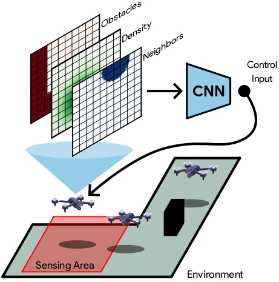
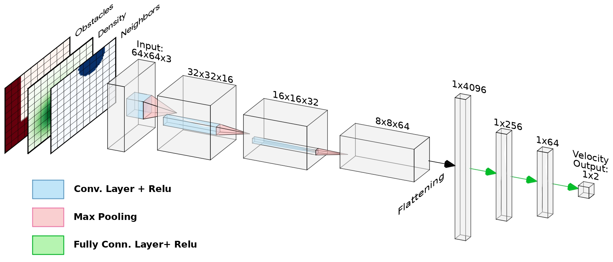
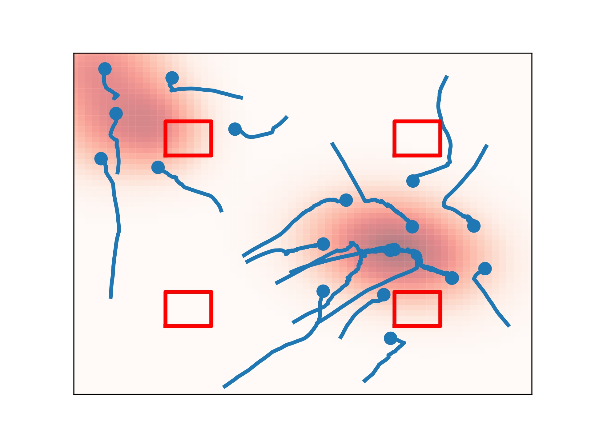
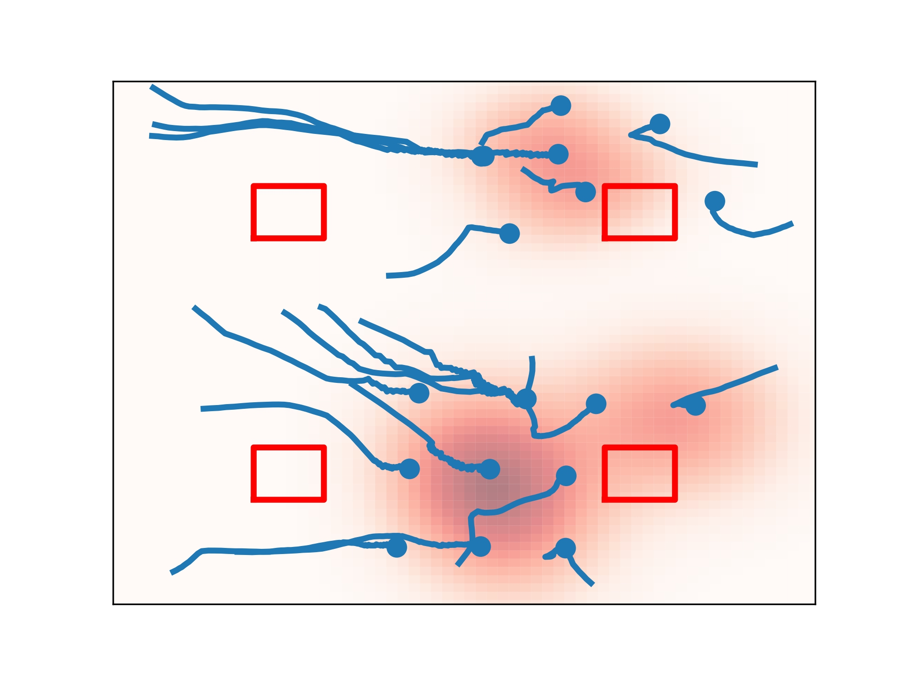

# cnn_coverage

This repository contains training and testing scripts for a decentralized CNN-based controller in a multi-robot coverage control scenario.

## Description

### Setup

    

 This CNN-based controller maps locally available information to control actions for each robot. Local information is represented in the form of a 3-channels grid-shaped object, where the first channel encodes information about the local density function, the second one the relative position of detected team-mates, and the third one the relative position of obstacles and boundaries. 
 
### CNN Architecture

 

 The model processes the input information and returns the 2D velocity for the robot. 

## Training
Data is collected running an expert algorithm, generating pairs of (images, velocities) pairs for the training algorithm to learn how to produce a suitable control input for the robot. 

A pre-collected dataset containing 40000 pairs is available here: 

## Testing
The model can be tested on a simulated scenario with the desired number of robots and obstacles. 

  

